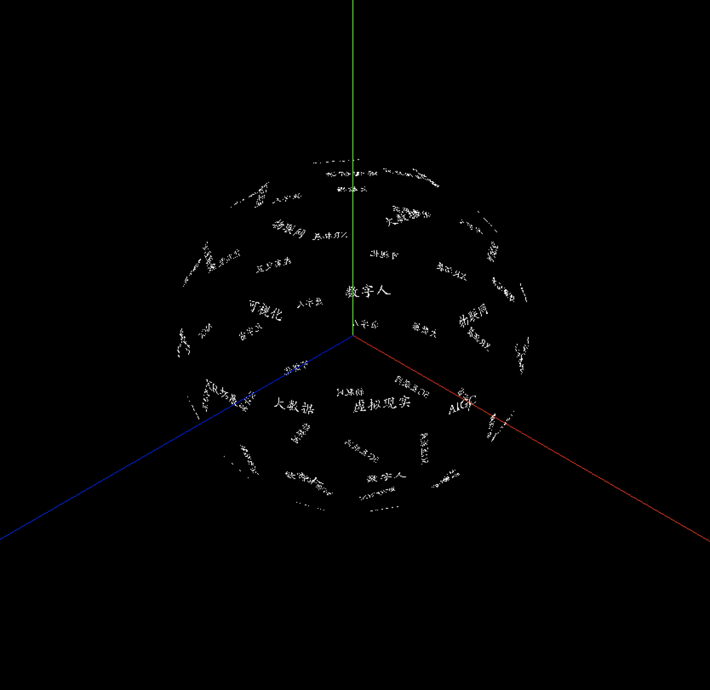
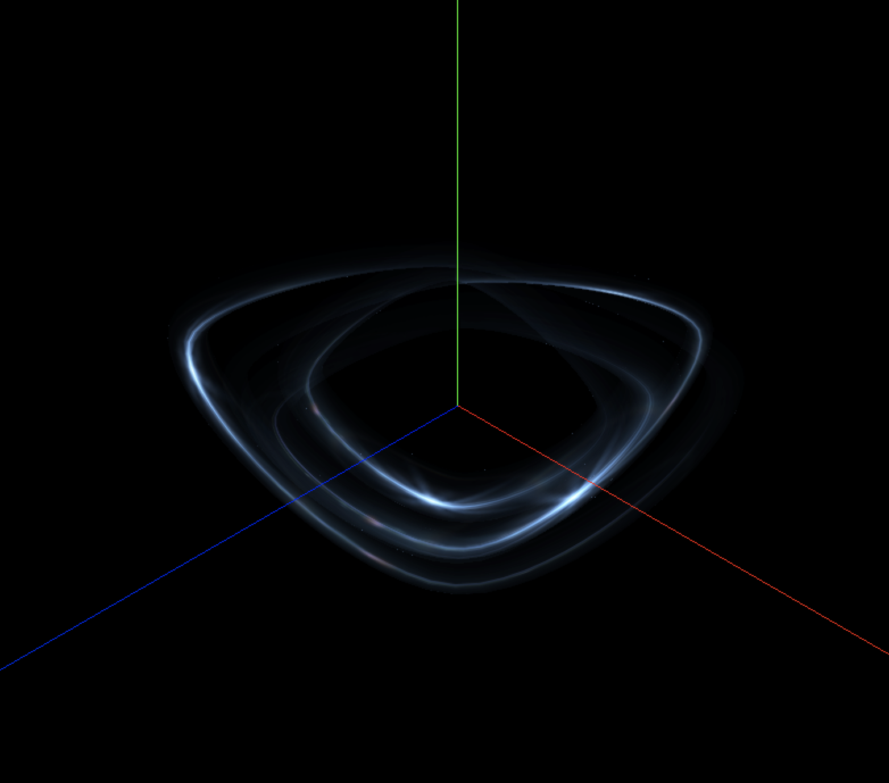
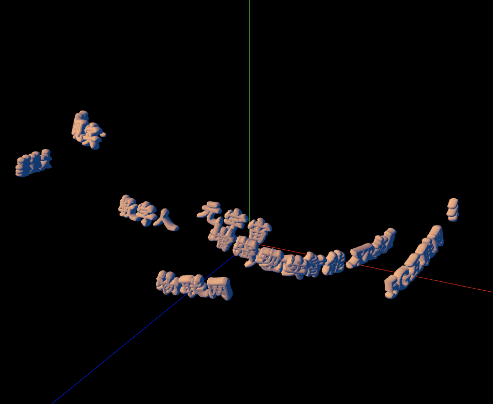

# threejs-learning

## [1. 3D文字环绕球体动画](./r152/3DTextWrappingSphereAnimation/README.md)

## [2. 3D文字环绕不规则曲线动画](./r152/3DTextWrappingIrregularCurveAnimation/README.md)

## [3. 管道环绕流光特效](./r152/PipelineStreamingSurroundingEffect/README.md)

## [4. 粒子螺旋上升动画](./r152/ParticleSpiralRiseAnimation/README.md)

## [5. 3D文字穿梭动画](./r152/3DTextShuttleAnimation/README.md)

## [6. 物体遮挡](./r152/OcclusiveObjectEffect/README.md)
